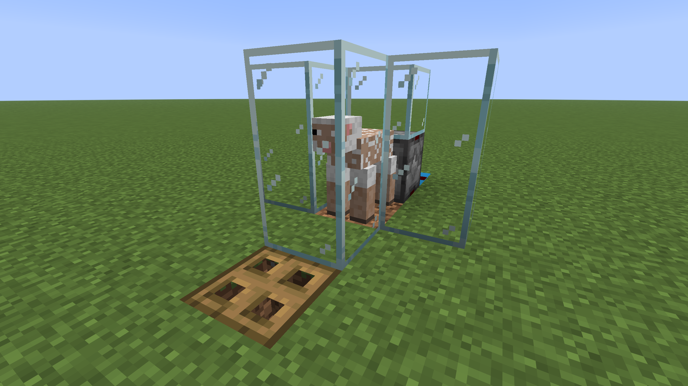

# Wool Farm - Single

The farm observes the grass block under the sheep, and when the sheep eats and regrows its wool. A dispenser shears the sheep and the wool is automatically collected.

## Minecraft Compatibility

**Edition:** Java  
**Tested Version(s):** 1.21  
**Requires Mods:** No

## Materials List

| Block       | Quantity | Block                             | Quantity |
| ----------- | -------- | --------------------------------- | -------- |
| Glass       | 7        | Hopper                            | 1        |
| Grass Block | 3        | Building Block (e.g. Grass Block) | 1        |
| Chest       | 1        | Observer                          | 1        |
| Dirt        | 1        | Rail                              | 1        |
| Dispenser   | 1        | Redstone Dust                     | 1        |

## Build Details

**AFK Required:** No, but the farm must be in loaded chunks to work.  
**Notes or Tips:** Building block (Light Blue Concrete) can be any solid block. It is blue in the schematic to illustrate that a redstone signal is passing through it.

## Creator Information

**Username:** Casual

**YouTube:** https://www.youtube.com/@CasualMinecraft  
**TikTok:** https://www.tiktok.com/@casual.minecraft  
**Reddit:** https://www.reddit.com/r/CasualMinecraft  
**Intagram:** https://www.instagram.com/casual.minecraft  
**Facebook:** https://www.facebook.com/CasualMinecraft
