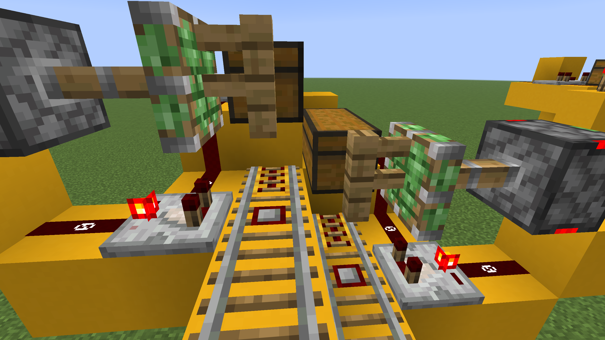
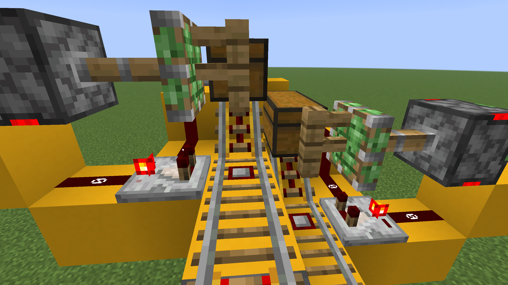

# Autoloading Super Smelter

Super smelter that automatically loads items and fuel from the input and fuel chests. Smelted items collect into an output chest.

## Minecraft Compatibility

**Edition:** Java  
**Tested Version(s):** 1.21  
**Requires Mods:** No

## Materials List

| Block          | Quantity | Block               | Quantity |
| -------------- | -------- | ------------------- | -------- |
| Hopper         | 48       | Redstone Comparator | 4        |
| Powered Rail   | 36       | Detector Rail       | 2        |
| Building Block | 33       | Fence               | 2        |
| Furnace        | 16       | Rail                | 2        |
| Redstone Dust  | 8        | Redstone Repeater   | 2        |
| Chest          | 6        | Sticky Piston       | 2        |
| Redstone Torch | 5        |                     |          |

## Build Details

**AFK Required:** No.  
**Notes or Tips:** The `.litematic` schematic works correctly without modification.

Using the WorldEdit `.schem` requires modification after placement. The powered rails leading into the input and fuel chests need to be fixed so that they ramp up into the chests. See the before and after images below. Also, hopper minecarts need to be added to each rail line.

## Creator Information

**Username:** Casual

**YouTube:** https://www.youtube.com/@CasualMinecraft  
**TikTok:** https://www.tiktok.com/@casual.minecraft  
**Reddit:** https://www.reddit.com/r/CasualMinecraft  
**Intagram:** https://www.instagram.com/casual.minecraft  
**Facebook:** https://www.facebook.com/CasualMinecraft
